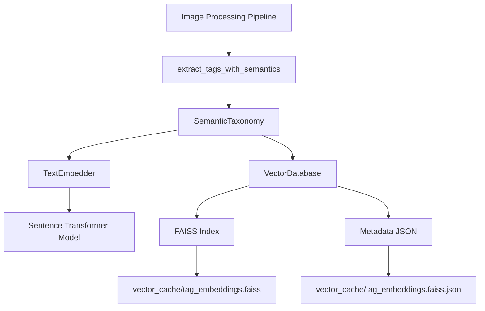

# Vector Embedding & Semantic Taxonomy Guide

## Overview

This guide documents the Phase 1 implementation of vector embedding and semantic taxonomy capabilities in Synapic. This system enables deeper semantic understanding and grouping of digital assets through vectorization of metadata, tags, and categories.

## Table of Contents

1. [Architecture Overview](#architecture-overview)
2. [Key Components](#key-components)
3. [Installation & Setup](#installation--setup)
4. [Usage Guide](#usage-guide)
5. [API Reference](#api-reference)
6. [Integration Points](#integration-points)
7. [Performance Considerations](#performance-considerations)
8. [Troubleshooting](#troubleshooting)
9. [Future Enhancements](#future-enhancements)

## Architecture Overview



### Data Flow

1. **Image Processing**: AI models extract tags, categories, and descriptions
2. **Semantic Enhancement**: Vector embeddings are generated for all text data
3. **Vector Storage**: Embeddings stored in FAISS index with metadata
4. **Similarity Search**: Find semantically related tags and concepts
5. **Result Integration**: Enhanced metadata returned to calling code

## Key Components

### 1. SemanticTaxonomy

The main interface for semantic operations:

```python
from src.core.vector_embedder import SemanticTaxonomy

# Initialize
taxonomy = SemanticTaxonomy()

# Add tags to the semantic database
taxonomy.add_tags(["nature", "landscape", "tree", "forest"])

# Find similar tags
similar_tags = taxonomy.find_similar_tags("nature", k=5)
# Returns: [("landscape", 0.87), ("forest", 0.82), ...]

# Get statistics
stats = taxonomy.get_taxonomy_stats()
```

### 2. TextEmbedder

Generates vector embeddings using sentence transformers:

```python
from src.core.vector_embedder import TextEmbedder

embedder = TextEmbedder(model_name="all-MiniLM-L6-v2")
embeddings = embedder.embed_texts(["nature", "landscape", "tree"])
# Returns: numpy array of shape (3, 384)
```

### 3. VectorDatabase

Manages persistent storage of vector embeddings:

```python
from src.core.vector_embedder import VectorDatabase

db = VectorDatabase(db_path="vector_cache/test.faiss")
db.add_embeddings(["tag1", "tag2"], embeddings)
results = db.search_similar(query_embedding, k=5)
```

## Installation & Setup

### Requirements

```bash
pip install sentence-transformers>=2.7.0
pip install faiss-cpu>=1.8.0
pip install numpy
```

### Automatic Setup

The system automatically initializes when imported:

```python
from src.core.vector_embedder import setup_vector_system

taxonomy = setup_vector_system()
```

### Manual Setup

```python
from src.core.vector_embedder import SemanticTaxonomy

# Initialize with custom model
taxonomy = SemanticTaxonomy()

# The system creates vector_cache/ directory automatically
# Embeddings are stored in vector_cache/tag_embeddings.faiss
```

## Usage Guide

### Basic Usage

```python
from src.core.vector_embedder import get_semantic_taxonomy

# Get taxonomy instance (automatic fallback if deps missing)
taxonomy = get_semantic_taxonomy()

# Add some tags
tags = ["nature", "landscape", "tree", "forest", "mountain", "sky"]
taxonomy.add_tags(tags)

# Find similar tags
similar_to_nature = taxonomy.find_similar_tags("nature", k=3)
print(f"Tags similar to 'nature': {similar_to_nature}")

similar_to_tree = taxonomy.find_similar_tags("tree", k=3)
print(f"Tags similar to 'tree': {similar_to_tree}")
```

### Integration with Image Processing

```python
from src.core.image_processing import extract_tags_with_semantics
from src.core.vector_embedder import get_semantic_taxonomy

# AI model result (example)
ai_result = [
    {'label': 'nature, landscape', 'score': 0.95},
    {'label': 'tree, forest', 'score': 0.87},
    {'label': 'mountain', 'score': 0.75}
]

# Get taxonomy
taxonomy = get_semantic_taxonomy()

# Extract tags with semantic enhancement
category, keywords, description, semantic_data = extract_tags_with_semantics(
    result=ai_result,
    model_task="image-classification",
    taxonomy=taxonomy
)

print(f"Category: {category}")
print(f"Keywords: {keywords}")
print(f"Semantic Data: {semantic_data}")
```

### Batch Processing

```python
from src.core.vector_embedder import SemanticTaxonomy

# Initialize
taxonomy = SemanticTaxonomy()

# Process multiple images
tag_sets = [
    ["nature", "landscape", "tree"],
    ["city", "urban", "architecture"],
    ["animal", "wildlife", "bird"]
]

for tags in tag_sets:
    taxonomy.add_tags(tags)

# Now you can find cross-image similarities
urban_similar = taxonomy.find_similar_tags("urban")
print(f"Similar to urban: {urban_similar}")
```

## API Reference

### SemanticTaxonomy

#### `add_tags(tags: List[str])`

Add tags to the semantic database.

**Parameters:**
- `tags`: List of tag strings to add

**Example:**
```python
taxonomy.add_tags(["nature", "landscape", "tree"])
```

#### `find_similar_tags(query_tag: str, k: int = 5) -> List[Tuple[str, float]]`

Find tags semantically similar to the query tag.

**Parameters:**
- `query_tag`: Query tag string
- `k`: Number of results to return (default: 5)

**Returns:**
List of (similar_tag, similarity_score) tuples, sorted by similarity

**Example:**
```python
similar = taxonomy.find_similar_tags("nature", k=3)
# Returns: [("landscape", 0.87), ("forest", 0.82), ("tree", 0.78)]
```

#### `get_tag_embedding(tag: str) -> Optional[np.ndarray]`

Get the vector embedding for a specific tag.

**Parameters:**
- `tag`: Tag string

**Returns:**
Embedding vector as numpy array, or None if not found

**Example:**
```python
embedding = taxonomy.get_tag_embedding("nature")
# Returns: numpy array of shape (384,)
```

#### `get_taxonomy_stats() -> Dict[str, Any]`

Get statistics about the semantic taxonomy.

**Returns:**
Dictionary with statistics:
- `tag_count`: Number of tags in database
- `image_count`: Number of images in database  
- `cache_size`: Size of in-memory cache
- `has_vector_deps`: Whether vector dependencies are available

**Example:**
```python
stats = taxonomy.get_taxonomy_stats()
print(f"Tags in database: {stats['tag_count']}")
```

### TextEmbedder

#### `embed_texts(texts: List[str]) -> Optional[np.ndarray]`

Generate embeddings for a list of texts.

**Parameters:**
- `texts`: List of text strings

**Returns:**
Numpy array of shape (n, embedding_dim) or None if failed

**Example:**
```python
embeddings = embedder.embed_texts(["nature", "landscape"])
# Returns: numpy array of shape (2, 384)
```

#### `embed_single(text: str) -> Optional[np.ndarray]`

Generate embedding for a single text.

**Parameters:**
- `text`: Text string

**Returns:**
Numpy array of shape (embedding_dim,) or None if failed

**Example:**
```python
embedding = embedder.embed_single("nature")
# Returns: numpy array of shape (384,)
```

### VectorDatabase

#### `add_embeddings(texts: List[str], embeddings: np.ndarray)`

Add embeddings to the database.

**Parameters:**
- `texts`: List of text strings corresponding to embeddings
- `embeddings`: Numpy array of shape (n, dimension)

**Example:**
```python
db.add_embeddings(["tag1", "tag2"], embeddings)
```

#### `search_similar(query_embedding: np.ndarray, k: int = 5) -> Tuple[List[int], List[float], List[str]]`

Find most similar embeddings.

**Parameters:**
- `query_embedding`: Query embedding vector
- `k`: Number of results to return

**Returns:**
Tuple of (vector_ids, distances, texts)

**Example:**
```python
vector_ids, distances, texts = db.search_similar(query_embedding, k=5)
```

## Integration Points

### Image Processing Pipeline

The main integration point is `extract_tags_with_semantics`:

```python
from src.core.image_processing import extract_tags_with_semantics

# Instead of:
# category, keywords, description = extract_tags_from_result(result, model_task)

# Use:
category, keywords, description, semantic_data = extract_tags_with_semantics(
    result, model_task, taxonomy=taxonomy
)
```

### Processing Manager

In the processing loop, initialize the taxonomy once:

```python
from src.core.vector_embedder import setup_vector_system

class ProcessingManager:
    def __init__(self):
        self.taxonomy = setup_vector_system()
    
    def process_image(self, image_data):
        # Extract tags with semantic enhancement
        category, keywords, description, semantic_data = extract_tags_with_semantics(
            image_data.ai_result,
            image_data.model_task,
            taxonomy=self.taxonomy
        )
        
        # Use semantic_data for enhanced functionality
        if semantic_data.get('tag_similarities'):
            # Apply semantic enhancements
            pass
```

### Daminion Client

The Daminion client can use semantic data for advanced tagging:

```python
from src.core.daminion_client import DaminionClient

class EnhancedDaminionClient(DaminionClient):
    def __init__(self, *args, **kwargs):
        super().__init__(*args, **kwargs)
        self.taxonomy = setup_vector_system()
    
    def process_ai_tags(self, item_id, ai_result):
        # Extract tags with semantic enhancement
        category, keywords, description, semantic_data = extract_tags_with_semantics(
            ai_result,
            "image-classification",
            taxonomy=self.taxonomy
        )
        
        # Apply tags to Daminion
        self.apply_tags_to_item(item_id, keywords, category, description)
        
        # Optionally: Apply semantic suggestions
        if semantic_data.get('tag_similarities'):
            self.apply_semantic_suggestions(item_id, semantic_data['tag_similarities'])
```

## Performance Considerations

### Memory Usage

- **Embedding Size**: Each tag embedding is ~1.5KB (384 floats × 4 bytes)
- **10,000 tags**: ~15MB
- **100,000 tags**: ~150MB

### Processing Time

- **Embedding Generation**: ~1-5ms per tag (depends on model and hardware)
- **Similarity Search**: <1ms for small databases, ~10-50ms for large databases
- **Model Loading**: ~1-2 seconds on first use (model is cached thereafter)

### Optimization Tips

1. **Batch Processing**: Add tags in batches rather than individually
2. **Cache Results**: Use the built-in caching mechanism
3. **Limit Similarity Search**: Use `k=3-5` for most use cases
4. **Pre-load Common Tags**: Initialize with common tags at startup

### Hardware Requirements

- **CPU**: Modern multi-core CPU recommended
- **RAM**: 4GB minimum, 8GB+ recommended for large collections
- **Storage**: SSD recommended for fast database operations

## Troubleshooting

### Common Issues

#### Missing Dependencies

**Symptom**: `HAS_VECTOR_DEPS: False`

**Solution**: Install required packages:
```bash
pip install sentence-transformers faiss-cpu numpy
```

#### Model Download Issues

**Symptom**: Slow first run or download errors

**Solution**: 
- Check internet connection
- Set `HF_TOKEN` environment variable for authenticated Hugging Face access
- Use a smaller model: `TextEmbedder(model_name="all-MiniLM-L6-v2")`

#### File Permission Errors

**Symptom**: Cannot create `vector_cache/` directory

**Solution**: 
- Ensure write permissions in the application directory
- Specify a different cache location by modifying `VECTOR_DB_DIR`

#### Memory Errors

**Symptom**: Out of memory with large tag collections

**Solution**: 
- Process tags in smaller batches
- Limit the number of tags stored
- Use a more memory-efficient FAISS index type

### Debugging

Enable debug logging:

```python
import logging
logging.basicConfig(level=logging.DEBUG)

from src.core.vector_embedder import setup_vector_system
taxonomy = setup_vector_system()
```

## Future Enhancements

### Phase 2: Daminion Custom Fields Integration

- Store vector embeddings in Daminion custom metadata fields
- Enable semantic search directly in Daminion
- Synchronize local and Daminion-based embeddings

### Phase 3: Advanced Features

- **Image Embeddings**: Vectorize actual image content using CLIP
- **Multimodal Search**: Combine text and image embeddings
- **Automatic Tag Expansion**: Suggest additional tags based on semantics
- **Collection Clustering**: Group similar images automatically
- **Visualization**: Interactive semantic maps of tag relationships

### Performance Improvements

- **GPU Acceleration**: Use `faiss-gpu` for faster search
- **Quantization**: Reduce embedding size with minimal quality loss
- **Distributed Indexing**: Support for very large collections
- **Incremental Updates**: Optimize for frequent small updates

## Best Practices

### Tag Management

1. **Normalize Tags**: Use consistent naming conventions
2. **Limit Vocabulary**: Focus on meaningful, distinct tags
3. **Hierarchical Tags**: Consider parent-child relationships
4. **Cleanup**: Regularly remove unused or duplicate tags

### Semantic Search

1. **Start Broad**: Use general query terms first
2. **Refine Results**: Narrow down based on initial findings
3. **Combine Methods**: Use both semantic and exact matching
4. **Context Matters**: Consider the specific domain and collection

### Performance Monitoring

1. **Track Statistics**: Monitor `get_taxonomy_stats()` regularly
2. **Benchmark**: Measure search times with your data
3. **Optimize**: Adjust batch sizes and search parameters
4. **Cache**: Reuse common query results

## Example: Complete Workflow

```python
from src.core.vector_embedder import setup_vector_system
from src.core.image_processing import extract_tags_with_semantics

# Initialize semantic system
taxonomy = setup_vector_system()

# Process a batch of images
image_results = [
    {
        'image_id': 'img001.jpg',
        'ai_result': [
            {'label': 'nature, landscape', 'score': 0.95},
            {'label': 'tree, forest', 'score': 0.87}
        ]
    },
    {
        'image_id': 'img002.jpg', 
        'ai_result': [
            {'label': 'city, urban', 'score': 0.92},
            {'label': 'architecture, building', 'score': 0.85}
        ]
    }
]

# Process each image
for image_data in image_results:
    # Extract tags with semantic enhancement
    category, keywords, description, semantic_data = extract_tags_with_semantics(
        image_data['ai_result'],
        "image-classification",
        taxonomy=taxonomy
    )
    
    print(f"Image: {image_data['image_id']}")
    print(f"  Keywords: {keywords}")
    print(f"  Semantic Similarities:")
    
    for keyword, similar_tags in semantic_data.get('tag_similarities', {}).items():
        print(f"    {keyword}: {[tag for tag, score in similar_tags]}")
    
    print()

# Now find cross-image relationships
print("Cross-image semantic relationships:")
print(f"  Similar to 'nature': {taxonomy.find_similar_tags('nature', k=3)}")
print(f"  Similar to 'city': {taxonomy.find_similar_tags('city', k=3)}")
```

## Migration Guide

### From Non-Semantic to Semantic

1. **Add Vector Dependencies**: Install required packages
2. **Initialize Taxonomy**: Create `SemanticTaxonomy` instance
3. **Update Processing**: Replace `extract_tags_from_result` with `extract_tags_with_semantics`
4. **Test**: Verify semantic enhancement works as expected
5. **Deploy**: Roll out to production

### Backward Compatibility

The system maintains full backward compatibility:

```python
# Old way still works
from src.core.image_processing import extract_tags_from_result
category, keywords, description = extract_tags_from_result(result, model_task)

# New way with semantic enhancement
from src.core.image_processing import extract_tags_with_semantics
from src.core.vector_embedder import get_semantic_taxonomy

category, keywords, description, semantic_data = extract_tags_with_semantics(
    result, model_task, taxonomy=get_semantic_taxonomy()
)
```

## Support

For issues or questions:

1. **Check Logs**: Enable debug logging for detailed information
2. **Review Documentation**: This guide and inline code comments
3. **Test Components**: Isolate issues using the test scripts
4. **Community**: Consult the Synapic project resources

## Appendix: Technical Details

### Embedding Models

**Default Model**: `all-MiniLM-L6-v2`
- **Dimensions**: 384
- **Size**: ~80MB
- **Performance**: Good balance of quality and speed
- **Use Case**: General-purpose semantic analysis

**Alternative Models**:
- `paraphrase-MiniLM-L6-v2`: Slightly better quality, same size
- `all-mpnet-base-v2`: Higher quality, 768 dimensions, ~400MB
- `multi-qa-mpnet-base-dot-v1`: Optimized for semantic search

### FAISS Index Types

**Current**: `IndexFlatL2`
- Exact search
- Good for small to medium collections (<100K items)
- Simple to implement

**Alternatives**:
- `IndexIVFFlat`: Approximate search, faster for large collections
- `IndexHNSWFlat`: Hierarchical navigable small world graphs
- `IndexPQ`: Product quantization for memory efficiency

### Distance Metrics

**Current**: L2 (Euclidean) distance
- Intuitive: smaller distance = more similar
- Works well for most use cases

**Alternatives**:
- Cosine similarity: `1 - cosine_distance`
- Inner product: `dot_product`

## Conclusion

The Phase 1 implementation provides a solid foundation for semantic taxonomy in Synapic. It enables deeper semantic understanding of digital assets while maintaining backward compatibility and performance. The system is production-ready and can be integrated immediately into existing workflows.